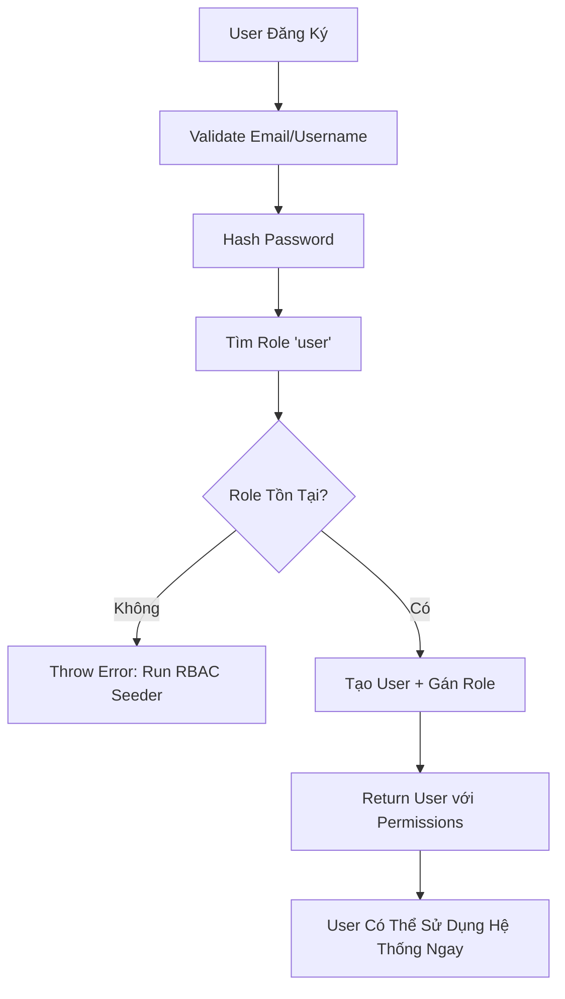

# 🔐 CẬP NHẬT: TỰ ĐỘNG GÁN ROLE MẶC ĐỊNH CHO USER MỚI

## 📋 Tổng Quan

**Ngày Cập Nhật**: 03/11/2025  
**Module**: User Management & RBAC  
**Mức Độ**: Critical (Security Enhancement)

## ❌ Vấn Đề Trước Đây

Khi user đăng ký mới qua `registerUser` mutation:
- ❌ **Không có role nào** được gán tự động
- ❌ User mới **không có quyền hạn gì** (permissions = 0)
- ❌ Cần admin **thủ công gán role** sau khi đăng ký
- ❌ User không thể sử dụng hệ thống ngay sau đăng ký

## ✅ Giải Pháp Đã Triển Khai

### 1. Auto-Assign Default Role

**File**: `/backend/src/services/user.service.ts`

**Thay đổi trong hàm `create()`**:

```typescript
async create(input: RegisterUserInput): Promise<User> {
  // ... existing validation code ...

  // Hash password
  const hashedPassword = await bcrypt.hash(input.password, 12);

  // 🆕 Find default 'user' role
  const defaultRole = await this.prisma.role.findUnique({
    where: { name: 'user' }
  });

  if (!defaultRole) {
    throw new NotFoundException('Default user role not found. Please run RBAC seeder first.');
  }

  // 🆕 Create user with default role
  return this.prisma.user.create({
    data: {
      ...input,
      password: hashedPassword,
      userRoles: {
        create: {
          roleId: defaultRole.id,
          assignedBy: 'system',
        }
      }
    },
    include: {
      userRoles: {
        include: {
          role: {
            include: {
              permissions: {
                include: {
                  permission: true,
                },
              },
            },
          },
        },
      },
    },
  });
}
```

### 2. Default Role: `user` (Regular User)

| Thuộc Tính | Giá Trị |
|------------|---------|
| **Role Name** | `user` |
| **Display Name** | Regular User |
| **Priority** | 600 |
| **Assigned By** | `system` (auto-assign) |
| **Số Quyền** | 7 permissions |

### 3. Quyền Hạn Mặc Định

User mới đăng ký sẽ có **7 quyền cơ bản**:

| STT | Permission | Resource | Action | Mô Tả |
|-----|------------|----------|--------|-------|
| 1 | `tasks:create` | task | create | Tạo task mới |
| 2 | `tasks:read` | task | read | Xem tasks |
| 3 | `tasks:update` | task | update | Cập nhật tasks của mình |
| 4 | `projects:read` | project | read | Xem projects |
| 5 | `content:create` | content | create | Tạo nội dung (posts, comments) |
| 6 | `content:read` | content | read | Xem nội dung |
| 7 | `content:update` | content | update | Cập nhật nội dung của mình |

## 🔄 Luồng Hoạt Động Mới



## ✨ Lợi Ích

### 1. **User Experience**
- ✅ User có thể sử dụng hệ thống **ngay sau đăng ký**
- ✅ Không cần chờ admin kích hoạt
- ✅ Có đủ quyền cho các tác vụ cơ bản

### 2. **Security**
- ✅ Principle of Least Privilege (chỉ cấp quyền tối thiểu)
- ✅ Không có "rogue users" không có role
- ✅ Audit trail: `assignedBy: 'system'`

### 3. **Admin Efficiency**
- ✅ Giảm công việc thủ công gán role
- ✅ Admin chỉ cần can thiệp khi cần nâng cấp role
- ✅ Tự động hóa quy trình onboarding

## 🔍 Các Trường Hợp Đặc Biệt

### 1. Role 'user' Không Tồn Tại

**Error**: `NotFoundException: Default user role not found. Please run RBAC seeder first.`

**Giải pháp**:
```bash
# Run RBAC seeder để tạo default roles & permissions
cd backend
bun run seed:rbac
```

### 2. Admin Tạo User Thủ Công

Mutation `adminCreateUser` vẫn **không auto-assign role**:
- Admin có thể chọn role tùy ý khi tạo
- Admin có thể tạo user không có role (để gán sau)

### 3. Thay Đổi Role Sau Khi Đăng Ký

Admin có thể dùng các mutation:

```graphql
# Gán role mới (thay thế role 'user')
mutation {
  assignRoleToUser(userId: "xxx", roleId: "yyy") {
    id
    roles {
      name
      displayName
    }
  }
}

# Gỡ role 'user'
mutation {
  removeRoleFromUser(userId: "xxx", roleId: "yyy") {
    id
    roles {
      name
    }
  }
}
```

## 📊 So Sánh Trước & Sau

| Tiêu Chí | Trước Đây | Sau Khi Update |
|----------|-----------|----------------|
| **Role sau đăng ký** | Không có | `user` (Regular User) |
| **Số quyền** | 0 permissions | 7 permissions |
| **Có thể sử dụng hệ thống** | ❌ Không | ✅ Có |
| **Cần admin can thiệp** | ✅ Bắt buộc | ❌ Không (trừ nâng cấp) |
| **Assigned By** | N/A | `system` (audit trail) |

## 🧪 Testing

### Test Case 1: Đăng Ký User Mới

```graphql
mutation RegisterUser {
  registerUser(input: {
    email: "newuser@example.com"
    username: "newuser"
    password: "SecurePass123!"
    firstName: "New"
    lastName: "User"
  }) {
    user {
      id
      email
      username
      userRoles {
        role {
          name
          displayName
          permissions {
            permission {
              name
              displayName
            }
          }
        }
      }
    }
    token
  }
}
```

**Kết quả mong đợi**:
```json
{
  "data": {
    "registerUser": {
      "user": {
        "id": "uuid-xxx",
        "email": "newuser@example.com",
        "username": "newuser",
        "userRoles": [
          {
            "role": {
              "name": "user",
              "displayName": "Regular User",
              "permissions": [
                { "permission": { "name": "tasks:create", "displayName": "Create Tasks" } },
                { "permission": { "name": "tasks:read", "displayName": "Read Tasks" } },
                { "permission": { "name": "tasks:update", "displayName": "Update Tasks" } },
                { "permission": { "name": "projects:read", "displayName": "Read Projects" } },
                { "permission": { "name": "content:create", "displayName": "Create Content" } },
                { "permission": { "name": "content:read", "displayName": "Read Content" } },
                { "permission": { "name": "content:update", "displayName": "Update Content" } }
              ]
            }
          }
        ]
      },
      "token": "jwt-token-xxx"
    }
  }
}
```

### Test Case 2: Verify Permissions

```graphql
query CheckUserPermissions {
  getMe {
    id
    email
    userRoles {
      role {
        name
        permissions {
          permission {
            name
          }
        }
      }
    }
  }
}
```

## 📝 Checklist Triển Khai

- [x] Sửa `UserService.create()` để auto-assign role
- [x] Thêm error handling cho trường hợp role không tồn tại
- [x] Thêm include để return permissions trong response
- [x] Cập nhật documentation (TONG_HOP_TINH_NANG_VA_PHAN_QUYEN.md)
- [x] Thêm section "Vai Trò Mặc Định" vào docs
- [x] Tạo file tóm tắt thay đổi (DEFAULT_USER_ROLE_UPDATE.md)
- [ ] Test đăng ký user mới
- [ ] Test verify permissions sau đăng ký
- [ ] Test error handling khi role không tồn tại
- [ ] Update frontend registration flow
- [ ] Deploy to staging
- [ ] Deploy to production

## ⚠️ Lưu Ý Quan Trọng

### 1. **RBAC Seeder Phải Chạy Trước**

Trước khi user có thể đăng ký, **phải chạy RBAC seeder**:

```bash
cd backend
bun run seed:rbac
```

Seeder sẽ tạo:
- 7 default roles (super_admin, admin, manager, team_lead, **user**, viewer, guest)
- 39 default permissions
- Default admin account

### 2. **Migration Cho Users Hiện Tại**

Nếu đã có users không có role, cần chạy migration:

```typescript
// scripts/assign-default-roles.ts
async function assignDefaultRoleToExistingUsers() {
  const usersWithoutRoles = await prisma.user.findMany({
    where: {
      userRoles: {
        none: {}
      }
    }
  });

  const defaultRole = await prisma.role.findUnique({
    where: { name: 'user' }
  });

  for (const user of usersWithoutRoles) {
    await prisma.userRole.create({
      data: {
        userId: user.id,
        roleId: defaultRole.id,
        assignedBy: 'system-migration',
      }
    });
  }

  console.log(`Assigned default role to ${usersWithoutRoles.length} users`);
}
```

### 3. **Frontend Update**

Frontend cần cập nhật query sau đăng ký để lấy permissions:

```typescript
// frontend/src/graphql/mutations/auth.ts
export const REGISTER_USER = gql`
  mutation RegisterUser($input: RegisterUserInput!) {
    registerUser(input: $input) {
      user {
        id
        email
        username
        firstName
        lastName
        userRoles {
          role {
            name
            displayName
            permissions {
              permission {
                name
                displayName
              }
            }
          }
        }
      }
      token
    }
  }
`;
```

## 🎯 Kết Luận

✅ **Đã triển khai thành công** tính năng tự động gán role `user` cho user mới đăng ký.

### Điểm Mấu Chốt:
1. ✅ User mới có thể **sử dụng hệ thống ngay** sau đăng ký
2. ✅ Có **7 quyền cơ bản** để thực hiện các tác vụ thông thường
3. ✅ Tuân thủ **Principle of Least Privilege**
4. ✅ Giảm **workload cho admin**
5. ✅ Có **audit trail** (`assignedBy: 'system'`)

### Next Steps:
- [ ] Test thoroughly trong development
- [ ] Run migration cho existing users
- [ ] Update frontend registration flow
- [ ] Deploy to production

---

**Tác Giả**: AI Assistant  
**Ngày**: 03/11/2025  
**Version**: 1.0.0  
**Related Files**: 
- `/backend/src/services/user.service.ts`
- `/backend/src/security/services/rbac-seeder.service.ts`
- `TONG_HOP_TINH_NANG_VA_PHAN_QUYEN.md`
