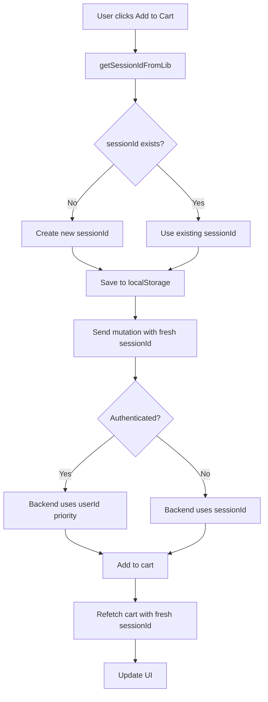

# Fix: "Either userId or sessionId is required" trong ADD_TO_CART

## 🐛 Vấn đề

Khi thêm sản phẩm vào giỏ hàng, gặp lỗi:
```json
{
  "addToCart": {
    "success": false,
    "message": "Either userId or sessionId is required",
    "cart": null
  }
}
```

## 🔍 Nguyên nhân

1. **State sessionId có thể stale hoặc empty string**: 
   - `useCartSession()` hook trả về state có thể là `''` (empty string) sau khi clear
   - State có thể `undefined` trong lúc initialization
   - State có thể không được update kịp thời

2. **Frontend dùng stale sessionId từ state**:
   ```tsx
   // ❌ SAI - Dùng state có thể stale
   const { sessionId } = useCartSession();
   await addToCart({
     variables: {
       input: {
         sessionId: sessionId, // Có thể là '', undefined, hoặc stale
       }
     }
   });
   ```

3. **Backend validation strict**:
   ```ts
   // cart.service.ts
   if (!normalizedUserId && !normalizedSessionId) {
     throw new BadRequestException('Either userId or sessionId is required');
   }
   ```

## ✅ Giải pháp

### Nguyên tắc: **Luôn lấy fresh sessionId từ localStorage trước mỗi mutation**

```tsx
import { getSessionId as getSessionIdFromLib } from '@/lib/session';

// ✅ ĐÚNG - Lấy fresh sessionId ngay trước mutation
const effectiveSessionId = getSessionIdFromLib();
await addToCart({
  variables: {
    input: {
      sessionId: effectiveSessionId, // Fresh value từ localStorage
    }
  }
});
```

## 📝 Files đã fix

### 1. `/frontend/src/components/ecommerce/AddToCartButton.tsx`

**Thêm import:**
```tsx
import { getSessionId as getSessionIdFromLib } from '@/lib/session';
```

**Fix handleAddToCart:**
```tsx
const handleAddToCart = async (e?: React.MouseEvent) => {
  // ...
  
  // ✅ Lấy fresh sessionId
  const effectiveSessionId = getSessionIdFromLib();
  
  console.log('[AddToCart] Mutation with:', {
    productId,
    variantId,
    quantity,
    sessionId: effectiveSessionId,
    isAuthenticated,
  });

  await addToCart({
    variables: {
      input: {
        productId,
        variantId,
        quantity,
        sessionId: effectiveSessionId, // ✅ Fresh value
      },
    },
  });
};
```

**Fix refetchQueries:**
```tsx
const [addToCart] = useMutation(ADD_TO_CART, {
  refetchQueries: [{ 
    query: GET_CART,
    variables: { sessionId: getSessionIdFromLib() }, // ✅ Fresh value
  }],
  awaitRefetchQueries: true,
  // ...
});
```

### 2. `/frontend/src/app/(website)/gio-hang/page.tsx`

**Thêm import:**
```tsx
import { getSessionId as getSessionIdFromLib } from '@/lib/session';
```

**Fix getQueryVariables:**
```tsx
const getQueryVariables = () => {
  // ✅ Lấy fresh sessionId thay vì dùng state
  const freshSessionId = getSessionIdFromLib();
  return { sessionId: freshSessionId };
};
```

### 3. `/frontend/src/app/(website)/yeu-thich/page.tsx`

**Fix refetchQueries:**
```tsx
const [addToCart, { loading: addingToCart }] = useMutation(ADD_TO_CART, {
  refetchQueries: [{ 
    query: GET_CART,
    variables: {
      sessionId: getSessionId(), // ✅ Fresh value
    },
  }],
  // ...
});
```

**Fix handleAddToCart:**
```tsx
const handleAddToCart = async (productId: string) => {
  // ✅ Lấy fresh sessionId
  const effectiveSessionId = getSessionId();
  
  await addToCart({ 
    variables: { 
      input: {
        productId, 
        quantity: 1,
        sessionId: effectiveSessionId, // ✅ Fresh value
      }
    } 
  });
};
```

## 🎯 Tại sao cần lấy fresh sessionId?

### Vấn đề với React state:

1. **State có thể stale**: React state không đồng bộ realtime với localStorage
2. **Empty string sau clear**: Sau khi clear session, state có thể là `''`
3. **Undefined during init**: Trong lúc initialization, state có thể undefined
4. **Race conditions**: State update có thể chậm hơn mutation

### Ưu điểm của fresh sessionId:

1. **Always accurate**: Đọc trực tiếp từ localStorage - source of truth
2. **Immediate**: Không đợi state update
3. **Consistent**: Đảm bảo mọi mutation đều dùng cùng 1 giá trị
4. **Defensive**: Tránh race conditions và stale state

## 🔄 Luồng hoạt động



## 🧪 Test cases

### ✅ Scenario 1: Guest user - first add
1. Chưa có sessionId trong localStorage
2. Click "Add to Cart"
3. `getSessionIdFromLib()` tạo sessionId mới
4. Mutation gửi sessionId mới
5. ✅ Backend tạo cart với sessionId → Thành công

### ✅ Scenario 2: Guest user - subsequent adds
1. Đã có sessionId trong localStorage
2. Click "Add to Cart"
3. `getSessionIdFromLib()` trả về sessionId hiện tại
4. Mutation gửi sessionId hiện tại
5. ✅ Backend tìm cart bằng sessionId → Thành công

### ✅ Scenario 3: Authenticated user
1. User đã đăng nhập
2. Click "Add to Cart"
3. `getSessionIdFromLib()` trả về sessionId (có thể từ guest session trước đó)
4. Mutation gửi sessionId
5. ✅ Backend ưu tiên userId, dùng sessionId làm fallback → Thành công

### ✅ Scenario 4: After cart merge
1. User có guest cart
2. User đăng nhập → carts merged
3. sessionId cleared (state = `''`)
4. Click "Add to Cart"
5. `getSessionIdFromLib()` tạo sessionId mới
6. ✅ Backend dùng userId từ auth context → Thành công

## 📊 So sánh

| Approach | Pros | Cons |
|----------|------|------|
| **State sessionId** (CŨ) | - Reactive updates | - Can be stale<br>- Empty string after clear<br>- Race conditions<br>- ❌ Causes "required" errors |
| **Fresh sessionId** (MỚI) | - Always accurate<br>- No race conditions<br>- Immediate<br>- ✅ Always works | - Extra function call (minimal overhead) |

## 🚀 Deployment

### Files modified:
- ✅ `/frontend/src/components/ecommerce/AddToCartButton.tsx`
- ✅ `/frontend/src/app/(website)/gio-hang/page.tsx`
- ✅ `/frontend/src/app/(website)/yeu-thich/page.tsx`

### Testing checklist:
```bash
# 1. Test guest add to cart
- [ ] Xóa localStorage
- [ ] Thêm sản phẩm vào cart
- [ ] Verify không có lỗi "Either userId or sessionId is required"
- [ ] Check cart có items

# 2. Test authenticated add to cart
- [ ] Đăng nhập
- [ ] Thêm sản phẩm vào cart
- [ ] Verify không có lỗi
- [ ] Check cart có items

# 3. Test cart operations
- [ ] Update quantity
- [ ] Remove item
- [ ] Clear cart
- [ ] Verify tất cả operations đều work

# 4. Test wishlist add to cart
- [ ] Vào trang yêu thích
- [ ] Click "Thêm vào giỏ"
- [ ] Verify không có lỗi
```

## 🎓 Best Practices

### DO ✅
```tsx
// Luôn lấy fresh sessionId trước mutation
const sessionId = getSessionIdFromLib();
await mutation({ variables: { sessionId } });
```

### DON'T ❌
```tsx
// Không dùng state sessionId trực tiếp
const { sessionId } = useCartSession();
await mutation({ variables: { sessionId } }); // Có thể stale!
```

### Pattern to follow:
```tsx
// 1. Import getSessionId
import { getSessionId } from '@/lib/session';

// 2. Get fresh before mutation
const handleAction = async () => {
  const sessionId = getSessionId();
  await mutation({
    variables: { 
      input: { sessionId, ...otherData }
    }
  });
};

// 3. Use fresh in refetchQueries
const [mutation] = useMutation(MUTATION, {
  refetchQueries: [{
    query: QUERY,
    variables: { sessionId: getSessionId() }
  }]
});
```

---

**Ngày fix**: 9/11/2025
**Người fix**: GitHub Copilot
**Trạng thái**: ✅ Hoàn thành
**Related**: FIX_AUTHENTICATED_CHECKOUT_SESSIONID.md
