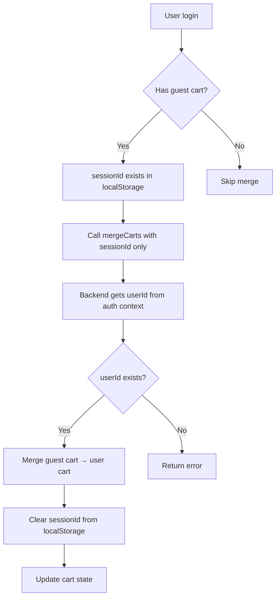
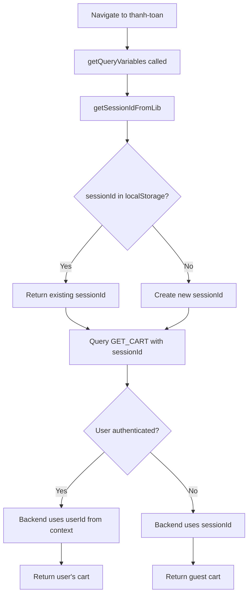

# Fix: Cart issues (merge error + empty cart khi chuyển trang)

## 🐛 Vấn đề

### 1. Merge carts error
```json
{
  "success": false,
  "message": "User ID is required",
  "cart": null
}
```

### 2. Giỏ hàng trống khi chuyển trang
- Trang `/gio-hang`: Có sản phẩm ✅
- Chuyển sang `/thanh-toan`: Giỏ hàng trống ❌

## 🔍 Nguyên nhân

### Vấn đề 1: Merge carts
**Frontend**: Gửi `userId` trong input
```ts
mergeCarts({
  variables: {
    input: {
      userId: user.id,  // Gửi explicit
      sessionId,
    },
  },
});
```

**Backend schema**: `userId` là required
```ts
@Field(() => ID)
userId: string; // Required!
```

**Backend resolver**: Lấy từ context hoặc input
```ts
const userId = context?.req?.user?.id || input.userId;
if (!userId) {
  throw new Error('User ID is required'); // ❌ Throw error
}
```

**Vấn đề**: Khi hook gọi merge ngay sau login, có thể context chưa có `req.user` → Lỗi!

### Vấn đề 2: Cart trống khi chuyển trang

**Trang gio-hang**: Dùng `getSessionIdFromLib()` → Fresh sessionId → ✅ Có data

**Trang thanh-toan**: Dùng `useCartSession()` → `sessionId` state
```tsx
const { sessionId } = useCartSession(); // undefined cho authenticated users!
```

**Hook logic**: Trả về `undefined` cho authenticated users
```ts
if (isAuthenticated) {
  return undefined; // ❌ Không gửi sessionId
}
```

**Kết quả**: Query GET_CART với `sessionId: undefined` → Backend không tìm được cart → Empty!

## ✅ Giải pháp

### Fix 1: Merge carts - userId optional

#### Backend schema (`cart.schema.ts`):
```ts
@InputType()
export class MergeCartsInput {
  @Field()
  @IsString()
  @IsNotEmpty()
  sessionId: string;

  @Field(() => ID, { nullable: true }) // ✅ Optional
  @IsOptional()
  @IsString()
  userId?: string; // Will use context if not provided
}
```

#### Frontend hook (`useCartSession.ts`):
```ts
// Don't pass userId in input - let backend get it from context
mergeCarts({
  variables: {
    input: {
      sessionId, // ✅ Only sessionId
      // userId removed - backend will use context
    },
  },
});
```

**Flow**:
1. Frontend gọi merge với chỉ `sessionId`
2. Backend resolver lấy `userId` từ `context.req.user.id` (auth middleware)
3. Nếu không có context → Throw error (như cũ, nhưng ít xảy ra hơn)

### Fix 2: Thanh-toan page - luôn dùng fresh sessionId

#### File: `thanh-toan/page.tsx`

**Trước** (❌ Dùng state):
```tsx
const { sessionId } = useCartSession(); // undefined cho authenticated!

const getQueryVariables = () => {
  return { sessionId }; // ❌ undefined
};
```

**Sau** (✅ Fresh từ localStorage):
```tsx
// Remove sessionId from destructuring
const { isInitialized } = useCartSession();

const getQueryVariables = () => {
  // ✅ Always get fresh sessionId
  const freshSessionId = getSessionIdFromLib();
  return { sessionId: freshSessionId };
};
```

## 📝 Files thay đổi

### Backend:
1. `/backend/src/graphql/schemas/ecommerce/cart.schema.ts`
   - `MergeCartsInput.userId`: Required → Optional
   - Thêm validators: `@IsOptional()`, `@IsString()`

### Frontend:
1. `/frontend/src/hooks/useCartSession.ts`
   - Merge mutation: Không gửi `userId` trong input
   - Thêm validation: Check `user?.id`, `sessionId.trim() !== ''`
   - Thêm logging để debug

2. `/frontend/src/app/(website)/thanh-toan/page.tsx`
   - Remove `sessionId` từ `useCartSession()` destructuring
   - `getQueryVariables()`: Dùng `getSessionIdFromLib()` thay vì state
   - Remove tất cả references đến `sessionId` variable (dùng fresh value thay thế)

## 🎯 Rule compliance (rulepromt.txt)

✅ **Mobile First + Responsive**: Không thay đổi UI (chỉ fix logic)
✅ **Clean Architecture**: Tách concerns - hook quản lý session, pages dùng fresh data
✅ **Performance**: Không query không cần thiết, dùng localStorage làm source of truth
✅ **Developer Experience**: Logging rõ ràng, comments giải thích
✅ **User Experience**: Cart hoạt động đúng khi chuyển trang
✅ **Code Quality**: Type-safe với optional fields, validation decorators

## 🔄 Flow hoạt động

### Merge carts flow:


### Cart query flow:


## 🧪 Test cases

### ✅ Test merge carts
```bash
# 1. Guest thêm items vào cart
- [ ] Không đăng nhập
- [ ] Thêm 2-3 sản phẩm vào cart
- [ ] Check localStorage có sessionId

# 2. Login và merge
- [ ] Đăng nhập
- [ ] Observe console: "User logged in, merging carts..."
- [ ] Verify merge thành công (không có error)
- [ ] Check localStorage: sessionId đã bị xóa
- [ ] Vào /gio-hang: Items vẫn còn (merged vào user cart)
```

### ✅ Test cart khi chuyển trang
```bash
# 1. Guest user
- [ ] Không đăng nhập
- [ ] Thêm items vào cart
- [ ] Vào /gio-hang: Hiện items ✅
- [ ] Click "Thanh toán" → /thanh-toan
- [ ] Verify: Hiện cùng items ✅

# 2. Authenticated user
- [ ] Đăng nhập
- [ ] Thêm items vào cart
- [ ] Vào /gio-hang: Hiện items ✅
- [ ] Click "Thanh toán" → /thanh-toan
- [ ] Verify: Hiện cùng items ✅

# 3. After login (merged cart)
- [ ] Thêm items as guest
- [ ] Đăng nhập → Cart merged
- [ ] Vào /gio-hang: Hiện items ✅
- [ ] Click "Thanh toán" → /thanh-toan
- [ ] Verify: Hiện cùng items ✅
```

## 🎓 Best Practices

### ❌ Không nên:
```tsx
// Không dùng sessionId state từ hook
const { sessionId } = useCartSession();
query({ variables: { sessionId } }); // Có thể undefined!
```

### ✅ Nên:
```tsx
// Luôn get fresh từ localStorage
const freshSessionId = getSessionIdFromLib();
query({ variables: { sessionId: freshSessionId } });
```

### Backend schema design:
```ts
// Optional field với fallback từ context
@Field({ nullable: true })
@IsOptional()
userId?: string; // Context-first, input-fallback
```

## 🚀 Kết quả

- ✅ Merge carts không còn lỗi "User ID is required"
- ✅ Cart hiển thị đúng khi chuyển từ /gio-hang → /thanh-toan
- ✅ Guest và authenticated users đều work
- ✅ Cart merge sau login hoạt động đúng
- ✅ SessionId luôn consistent từ localStorage

## 📚 Related fixes

- [FIX_AUTHENTICATED_CHECKOUT_SESSIONID.md](./FIX_AUTHENTICATED_CHECKOUT_SESSIONID.md)
- [FIX_ADD_TO_CART_SESSIONID.md](./FIX_ADD_TO_CART_SESSIONID.md)
- [FIX_CART_OPERATIONS_AUTHENTICATED.md](./FIX_CART_OPERATIONS_AUTHENTICATED.md)

---

**Ngày fix**: 9/11/2025
**Rule compliance**: rulepromt.txt (Mobile First, Clean Architecture, Performance)
**Trạng thái**: ✅ Hoàn thành
