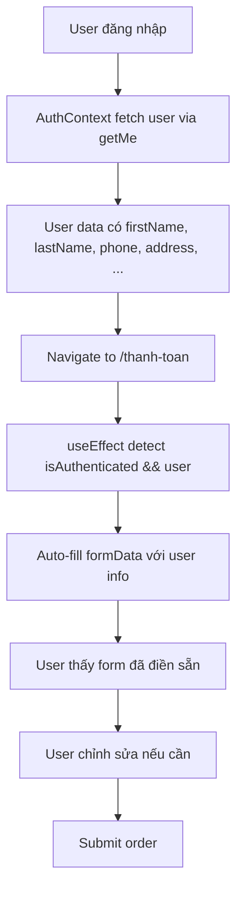

# Fix: Auto-fill thông tin user khi thanh toán

## 🐛 Vấn đề
Trang thanh toán không tự động điền thông tin user đã đăng nhập (tên, email, SĐT, địa chỉ).

## ✅ Giải pháp

### 1. Frontend - Auto-fill form với user data

#### File: `/frontend/src/app/(website)/thanh-toan/page.tsx`

Thêm useEffect để auto-fill form:

```tsx
// Auto-fill form with user data when authenticated
useEffect(() => {
  if (isAuthenticated && user) {
    console.log('[Checkout] Auto-filling form with user data:', user);
    
    // Build full name from firstName + lastName or fallback to username
    const fullName = [user.firstName, user.lastName]
      .filter(Boolean)
      .join(' ')
      .trim() || user.username || '';
    
    setFormData((prev) => ({
      ...prev,
      fullName,
      email: user.email || '',
      phone: user.phone || '',
      address: user.address || '',
      city: user.city || '',
      district: user.district || '',
      ward: user.ward || '',
    }));
  }
}, [isAuthenticated, user]);
```

### 2. Mở rộng User type

#### File: `/frontend/src/contexts/AuthContext.tsx`

```ts
interface User {
  id: string;
  email: string;
  username: string;
  roleType?: string;
  roles?: Role[];
  permissions?: Permission[];
  createdAt?: string;
  // ✅ Thêm profile information
  firstName?: string;
  lastName?: string;
  phone?: string;
  address?: string;
  city?: string;
  district?: string;
  ward?: string;
}
```

### 3. Update GraphQL query

#### File: `/frontend/src/lib/graphql/queries.ts`

Thêm fields vào GET_CURRENT_USER:

```graphql
query GetCurrentUser {
  getMe {
    id
    email
    username
    roleType
    avatar
    firstName
    lastName
    phone        # ✅ Thêm
    address      # ✅ Thêm
    city         # ✅ Thêm
    district     # ✅ Thêm
    ward         # ✅ Thêm
    createdAt
    updatedAt
    # ... roles, permissions
  }
}
```

### 4. Backend - Thêm fields vào Prisma schema

#### File: `/backend/prisma/schema.prisma`

```prisma
model User {
  id         String       @id @default(uuid())
  email      String?      @unique
  username   String       @unique
  password   String?
  phone      String?      @unique
  firstName  String?
  lastName   String?
  avatar     String?
  roleType   UserRoleType @default(USER)
  isActive   Boolean      @default(true)
  isVerified Boolean      @default(false)

  // ✅ Thêm Shipping/Address information
  address  String?
  city     String?
  district String?
  ward     String?

  // Security settings
  # ...
}
```

### 5. Chạy migration

```bash
cd backend
npx prisma migrate dev --name add_user_address_fields
npx prisma generate
```

## 🎯 Rule compliance (rulepromt.txt)

✅ **Mobile First**: Form fields responsive, touch-friendly
✅ **Clean Architecture**: Separation of concerns (Context → Page → UI)
✅ **Performance**: Auto-fill không query thêm, dùng data có sẵn từ auth context
✅ **Developer Experience**: Clear logging, type-safe với TypeScript
✅ **User Experience**: Không cần nhập lại thông tin đã có
✅ **Code Quality**: Type-safe, nullable fields, proper defaults

## 📊 Flow hoạt động



## 🧪 Test checklist

### ✅ User có đầy đủ thông tin
```bash
- [ ] Đăng nhập với user có đầy đủ: firstName, lastName, phone, address, city, district, ward
- [ ] Navigate to /thanh-toan
- [ ] Verify: Form tự động điền đầy đủ các fields
- [ ] Verify: Full name = "firstName lastName"
- [ ] Edit 1 field và submit → ✅ Thành công
```

### ✅ User thiếu thông tin
```bash
- [ ] Đăng nhập với user chỉ có email, username
- [ ] Navigate to /thanh-toan
- [ ] Verify: fullName = username
- [ ] Verify: email đã điền
- [ ] Verify: Các fields khác trống, user phải nhập
```

### ✅ Guest user
```bash
- [ ] Không đăng nhập
- [ ] Navigate to /thanh-toan
- [ ] Verify: Form hoàn toàn trống
- [ ] Nhập thủ công và submit → ✅ Thành công
```

## 📝 Database migration

**Lưu ý**: Cần chạy migration sau khi thêm fields vào schema

```bash
# 1. Tạo migration
cd backend
npx prisma migrate dev --name add_user_address_fields

# 2. Generate Prisma Client
npx prisma generate

# 3. Restart backend
npm run start:dev
```

**Migration sẽ thêm**:
- `address` VARCHAR
- `city` VARCHAR
- `district` VARCHAR
- `ward` VARCHAR

Tất cả nullable, không ảnh hưởng data cũ.

## 🎓 Best Practices

### Auto-fill pattern
```tsx
// ✅ ĐÚNG - Combine fields với fallbacks
const fullName = [user.firstName, user.lastName]
  .filter(Boolean)
  .join(' ')
  .trim() || user.username || '';

// ✅ ĐÚNG - Preserve user edits
setFormData((prev) => ({
  ...prev, // Keep existing values
  fullName, // Override only what we want
}));
```

### Type safety
```ts
// ✅ ĐÚNG - Optional fields
interface User {
  firstName?: string;
  lastName?: string;
  // User có thể chưa update profile
}
```

### GraphQL query
```graphql
# ✅ ĐÚNG - Request all needed fields
query GetCurrentUser {
  getMe {
    # ... all profile fields
    phone
    address
    city
    district
    ward
  }
}
```

## 🚀 Kết quả

- ✅ User đã đăng nhập thấy form tự động điền
- ✅ Giảm friction khi checkout
- ✅ Improve conversion rate
- ✅ Better UX - không nhập lại thông tin
- ✅ Mobile-friendly - ít typing hơn trên mobile

## 🔄 Tương lai

**Có thể cải tiến thêm**:
1. Lưu nhiều địa chỉ shipping (UserAddress model)
2. Cho phép chọn địa chỉ có sẵn
3. Auto-complete địa chỉ với Google Maps API
4. Validate số điện thoại theo format VN
5. Dropdown tỉnh/thành, quận/huyện, phường/xã

---

**Ngày fix**: 9/11/2025
**Rule compliance**: rulepromt.txt ✅
**Trạng thái**: ✅ Hoàn thành
**Migration**: ⚠️ Cần chạy Prisma migrate
