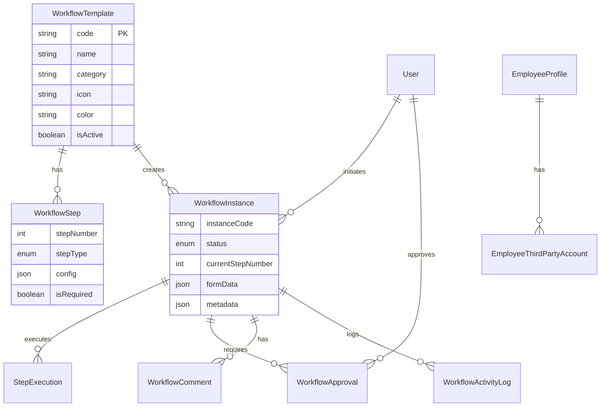

# 🔄 WORKFLOW SYSTEM - README

## 📚 Tài liệu hệ thống

Hệ thống Workflow cung cấp framework hoàn chỉnh để quản lý các quy trình nghiệp vụ trong doanh nghiệp.

---

## 📖 CÁC TÀI LIỆU

### 1. [HE_THONG_WORKFLOW.md](./HE_THONG_WORKFLOW.md) - **Tài liệu kỹ thuật**
**Dành cho**: Developer, Tech Lead, System Architect

**Nội dung**:
- ✅ Kiến trúc hệ thống (Backend + Frontend + Database)
- ✅ API GraphQL chi tiết (Queries + Mutations)
- ✅ Database Schema (9 models)
- ✅ Service layer architecture
- ✅ Frontend components structure
- ✅ Use case: Employee Onboarding (5 bước)
- ✅ Examples: FormData, Metadata
- ✅ Security & Permissions
- ✅ Installation & Setup

### 2. [HUONG_DAN_TAO_WORKFLOW_MOI.md](./HUONG_DAN_TAO_WORKFLOW_MOI.md) - **Hướng dẫn code**
**Dành cho**: Developer cần tạo workflow mới

**Nội dung**:
- ✅ Sử dụng workflow có sẵn (GraphQL examples)
- ✅ Tạo workflow đơn giản (không cần Service)
- ✅ Tạo workflow phức tạp (với Service riêng)
- ✅ 5 loại Step Type chi tiết (FORM, APPROVAL, NOTIFICATION, AUTOMATION, CONDITION)
- ✅ 3 Examples thực tế (Tạm ứng, Phê duyệt tài liệu, Onboarding thiết bị)
- ✅ Best Practices & Testing
- ✅ Troubleshooting
- ✅ Code samples đầy đủ (copy-paste ready)

### 3. [HUONG_DAN_SU_DUNG_UI_WORKFLOW.md](./HUONG_DAN_SU_DUNG_UI_WORKFLOW.md) - **Hướng dẫn UI/UX**
**Dành cho**: End Users, HR, Manager, Admin

**Nội dung**:
- ✅ Đường dẫn truy cập hệ thống
- ✅ Dashboard Workflow (giao diện chính)
- ✅ Tạo workflow instance (Form wizard)
- ✅ Xem chi tiết workflow
- ✅ Danh sách workflows của tôi
- ✅ Phê duyệt (Approval interface)
- ✅ Tạo workflow template mới (Admin)
- ✅ Navigation & Menu structure
- ✅ Mobile view (responsive)
- ✅ Quick actions & Widgets
- ✅ Permission & Roles matrix
- ✅ User flow điển hình (3 scenarios)
- ✅ Troubleshooting UI

---

## 🚀 QUICK START

### Cho Developer:

```bash
# 1. Backend đã setup sẵn
cd backend
bun run dev:backend
# Backend: http://localhost:4000
# GraphQL Playground: http://localhost:4000/graphql

# 2. Frontend đã có components
cd frontend
bun run dev:frontend
# Frontend: http://localhost:3000
```

### Cho End User:

1. Truy cập: `http://localhost:3000/workflow`
2. Login với tài khoản của bạn
3. Xem [HUONG_DAN_SU_DUNG_UI_WORKFLOW.md](./HUONG_DAN_SU_DUNG_UI_WORKFLOW.md) để biết cách sử dụng

---

## 🎯 USE CASES ĐÃ IMPLEMENT

### 1. ✅ Employee Checkin (Nhân sự)
**Mục đích**: Tự động hóa quy trình nhập thông tin nhân viên mới

**Flow**: 5 bước
1. Nhập thông tin cơ bản (FORM)
2. Tạo tài khoản User (AUTOMATION)
3. Thêm tài khoản bên thứ 3 - Gmail, Slack, CRM... (FORM)
4. Phê duyệt từ HR Manager (APPROVAL)
5. Xác nhận cuối từ nhân viên (NOTIFICATION)

**Code**: 
- Service: `backend/src/workflow/employee-onboarding.service.ts`
- Component: `frontend/src/components/workflow/EmployeeOnboardingForm.tsx`

### 2. 📝 Template sẵn sàng mở rộng:
- Yêu cầu nghỉ phép
- Xin tạm ứng
- Phê duyệt đơn hàng lớn
- Phê duyệt tài liệu
- Onboarding thiết bị

---

## 📦 COMPONENTS ĐÃ XÂY DỰNG

### Backend (NestJS + GraphQL):
- ✅ `WorkflowService` - Core workflow operations
- ✅ `EmployeeOnboardingService` - Employee checkin
- ✅ `WorkflowResolver` - GraphQL API (11 queries + 8 mutations)
- ✅ `WorkflowModule` - Module configuration
- ✅ Entities + DTOs đầy đủ

### Frontend (Next.js + Shadcn UI):
- ✅ `WorkflowTemplateList.tsx` - Grid view templates
- ✅ `WorkflowInstanceView.tsx` - Chi tiết instance + Approval UI
- ✅ `EmployeeOnboardingForm.tsx` - Multi-step wizard
- ✅ GraphQL queries/mutations client

### Database (Prisma + PostgreSQL):
- ✅ 9 models mới (WorkflowTemplate, WorkflowStep, WorkflowInstance, StepExecution, WorkflowApproval, WorkflowComment, WorkflowActivityLog, EmployeeThirdPartyAccount, + Enums)
- ✅ Đã push lên database thành công

---

## 🔐 PERMISSIONS

| Role        | Xem Templates | Tạo Instance | Approve | Tạo Template |
|-------------|---------------|--------------|---------|--------------|
| Employee    | ✅            | ✅           | ⚠️*     | ❌           |
| Manager     | ✅            | ✅           | ✅      | ❌           |
| HR Manager  | ✅            | ✅           | ✅      | ❌           |
| Admin       | ✅            | ✅           | ✅      | ✅           |

*Chỉ nếu là approver được assign

---

## 🛣️ ROUTES

### Frontend Routes:
```
/workflow                          → Dashboard
/workflow/templates                → Template list
/workflow/templates/new            → Create template (Admin)
/workflow/templates/{id}           → Template detail

/workflow/instances                → All instances
/workflow/my-instances             → My instances
/workflow/instances/{id}           → Instance detail

/workflow/my-approvals             → Pending approvals
/workflow/employee-onboarding/new  → Employee checkin form
```

### GraphQL Endpoints:
```
Query:
- workflowTemplates(category, isActive)
- workflowTemplate(id)
- workflowInstances(status, initiatedBy)
- myWorkflowInstances
- workflowInstance(id)
- myPendingApprovals

Mutation:
- createWorkflowTemplate(input)
- updateWorkflowTemplate(id, input)
- createWorkflowInstance(input)
- completeStep(input)
- respondToApproval(input)
- createWorkflowComment(input)
- cancelWorkflowInstance(id, reason)
- startEmployeeOnboarding(input)
- setupEmployeeOnboardingWorkflow
```

---

## 📊 DATABASE SCHEMA



---

## 🎨 UI/UX FEATURES

- ✅ **Mobile-first responsive design**
- ✅ **Dark mode support**
- ✅ **Real-time updates** (poll every 10s)
- ✅ **Progress bar** cho multi-step workflows
- ✅ **Toast notifications** (Sonner)
- ✅ **Form validation** real-time
- ✅ **Combobox** cho tất cả Select (theo rule)
- ✅ **Dialog layout** chuẩn (Header/Content/Footer)
- ✅ **Vietnamese** interface toàn bộ
- ✅ **Icons** từ Lucide React
- ✅ **Shadcn UI** components

---

## 🔧 CONFIGURATION

### Environment Variables:
```env
# Backend
DATABASE_URL="postgresql://..."
JWT_SECRET="..."

# Frontend
NEXT_PUBLIC_GRAPHQL_URL="http://localhost:4000/graphql"
```

### Prisma:
```bash
# Generate client
bunx prisma generate

# Push schema to database
bunx prisma db push

# Open Prisma Studio
bunx prisma studio
```

---

## 📝 EXAMPLES

### 1. Setup workflow lần đầu:
```graphql
mutation {
  setupEmployeeOnboardingWorkflow
}
```

### 2. Bắt đầu checkin nhân sự:
```graphql
mutation {
  startEmployeeOnboarding(
    input: {
      formData: {
        fullName: "Nguyễn Văn A"
        email: "nguyenvana@company.com"
        phone: "0901234567"
        position: "Developer"
        department: "IT"
        startDate: "2024-12-01"
      }
    }
  ) {
    id
    instanceCode
    status
  }
}
```

### 3. Phê duyệt:
```graphql
mutation {
  respondToApproval(
    input: {
      approvalId: "..."
      decision: "APPROVED"
      comment: "Thông tin đầy đủ!"
    }
  )
}
```

### 4. Xem workflows của tôi:
```graphql
query {
  myWorkflowInstances {
    id
    title
    status
    currentStepNumber
  }
}
```

---

## 🐛 TROUBLESHOOTING

### Backend issues:
```bash
# Check logs
bun run dev:backend

# Check database
bunx prisma studio
```

### Frontend issues:
```bash
# Check GraphQL connection
# Open browser console at /workflow

# Check component rendering
bun run dev:frontend
```

### Database issues:
```bash
# Reset database (CAUTION: loses data)
bunx prisma migrate reset

# Or push schema
bunx prisma db push
```

---

## 📞 SUPPORT

- **Technical Issues**: Check [HE_THONG_WORKFLOW.md](./HE_THONG_WORKFLOW.md) → Troubleshooting section
- **How to create workflow**: Check [HUONG_DAN_TAO_WORKFLOW_MOI.md](./HUONG_DAN_TAO_WORKFLOW_MOI.md)
- **UI/UX questions**: Check [HUONG_DAN_SU_DUNG_UI_WORKFLOW.md](./HUONG_DAN_SU_DUNG_UI_WORKFLOW.md)
- **GraphQL API**: Open http://localhost:4000/graphql

---

## 🎯 ROADMAP (Future enhancements)

- [ ] Email notifications cho approvals
- [ ] SMS notifications
- [ ] Webhook integrations
- [ ] Workflow analytics dashboard
- [ ] Export workflow history to Excel/PDF
- [ ] Workflow templates marketplace
- [ ] Visual workflow designer (drag & drop)
- [ ] Parallel approvals (multiple branches)
- [ ] Conditional routing (dynamic step flow)
- [ ] SLA tracking & alerts

---

## ✅ CHECKLIST TẠO WORKFLOW MỚI

1. **Backend**:
   - [ ] Tạo Service file (`your-workflow.service.ts`)
   - [ ] Implement `setupYourWorkflow()` method
   - [ ] Implement `startYourWorkflow()` method
   - [ ] Add DTOs (`dto/workflow.dto.ts`)
   - [ ] Add mutations to Resolver
   - [ ] Update Module providers/exports

2. **Frontend**:
   - [ ] Tạo Form component (`YourWorkflowForm.tsx`)
   - [ ] Add GraphQL mutations
   - [ ] Add route `/workflow/your-workflow/new`
   - [ ] Test responsive design
   - [ ] Add to navigation menu

3. **Testing**:
   - [ ] Test GraphQL mutations in Playground
   - [ ] Test UI form validation
   - [ ] Test approval flow
   - [ ] Test mobile view
   - [ ] Check activity logs

4. **Documentation**:
   - [ ] Update workflow list in this README
   - [ ] Add example queries
   - [ ] Document special business logic
   - [ ] Add screenshots (optional)

---

**Status**: 
- ✅ Backend: Hoàn thành
- ✅ Frontend: Hoàn thành  
- ✅ Database: Đã push
- ✅ Documentation: Đầy đủ (3 files)

**Version**: 1.0.0  
**Last Updated**: November 29, 2025
