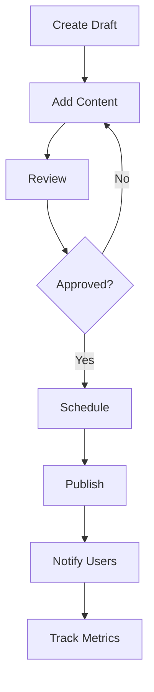
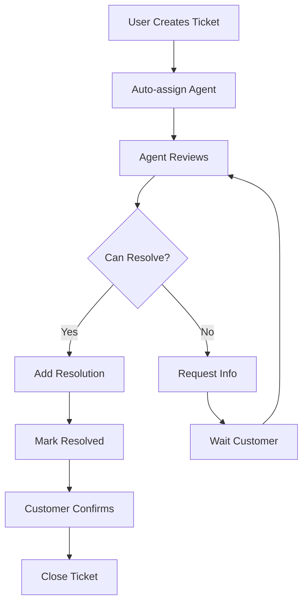

# 🚀 Release Hub & Support Center System

> Hệ thống quản lý phát hành phần mềm và hỗ trợ khách hàng

**Đọc trong**: ~20 phút

---

## 📋 Tổng quan

Release Hub & Support Center là hệ thống tích hợp giúp bạn:
- 📦 **Quản lý phát hành** - Release versioning, changelog, upgrade guides
- 🎫 **Support ticketing** - Technical support ticket system
- 📚 **Knowledge base** - System guides and documentation
- 📊 **Analytics** - Track downloads, views, support metrics

---

## 🏗️ Kiến trúc

### Public Routes
```
/releases              → Danh sách releases công khai
/releases/[slug]       → Chi tiết release
/support               → Support center (my tickets)
/support/new           → Tạo support ticket mới
/support/ticket/[id]   → Chi tiết ticket
/guides                → Knowledge base
/guides/[slug]         → Chi tiết guide
```

### Admin Routes
```
/admin/releases        → Quản lý releases
/admin/support         → Quản lý support tickets
```

### Backend Modules
```
backend/src/release-hub/
├── entities/
│   ├── system-release.entity.ts
│   ├── technical-support.entity.ts
│   └── system-guide.entity.ts
├── services/
│   ├── system-release.service.ts
│   ├── technical-support.service.ts
│   └── system-guide.service.ts
├── resolvers/
│   ├── system-release.resolver.ts
│   ├── technical-support.resolver.ts
│   └── system-guide.resolver.ts
├── dto/
│   ├── system-release.input.ts
│   ├── technical-support.input.ts
│   └── system-guide.input.ts
└── release-hub.module.ts
```

---

## 📦 System Releases

### Release Types

| Type | Description | Version Example |
|------|-------------|-----------------|
| `MAJOR` | Breaking changes | v1.0.0 → v2.0.0 |
| `MINOR` | New features | v1.0.0 → v1.1.0 |
| `PATCH` | Bug fixes | v1.0.0 → v1.0.1 |
| `HOTFIX` | Critical fixes | v1.0.0 → v1.0.0-hotfix.1 |

### Release Status

- `DRAFT` - Đang soạn thảo
- `SCHEDULED` - Đã lên lịch
- `RELEASED` - Đã phát hành
- `DEPRECATED` - Không còn hỗ trợ

### Tạo Release (Admin)

```typescript
import { useMutation } from '@apollo/client';
import { CREATE_SYSTEM_RELEASE } from '@/graphql/release-hub/release.queries';

const [createRelease] = useMutation(CREATE_SYSTEM_RELEASE);

const handleCreate = async () => {
  await createRelease({
    variables: {
      input: {
        version: 'v1.5.0',
        releaseType: 'MINOR',
        title: 'Enhanced User Management',
        summary: 'New features for user roles and permissions',
        features: [
          'Advanced RBAC system',
          'Custom role creation',
          'Permission templates'
        ],
        improvements: [
          'Faster user search',
          'Better UI/UX'
        ],
        bugfixes: [
          'Fixed login redirect issue',
          'Resolved pagination bug'
        ],
        releaseNotes: '## What\'s New\n\n...',
        upgradeGuide: '## Upgrade Steps\n\n1. Backup database\n...'
      }
    }
  });
};
```

### Query Releases (Public)

```typescript
import { useQuery } from '@apollo/client';
import { GET_SYSTEM_RELEASES } from '@/graphql/release-hub/release.queries';

function ReleasesPage() {
  const { data, loading } = useQuery(GET_SYSTEM_RELEASES, {
    variables: {
      where: { status: 'RELEASED' },
      take: 20,
      skip: 0
    }
  });

  return (
    <div>
      {data?.systemReleases?.map((release) => (
        <div key={release.id}>
          <h2>{release.version} - {release.title}</h2>
          <p>{release.summary}</p>
          <Link href={`/releases/${release.slug}`}>
            Chi tiết →
          </Link>
        </div>
      ))}
    </div>
  );
}
```

### Get Release by Slug

```typescript
import { useQuery } from '@apollo/client';
import { GET_SYSTEM_RELEASE_BY_SLUG } from '@/graphql/release-hub/release.queries';

function ReleaseDetailPage({ slug }) {
  const { data } = useQuery(GET_SYSTEM_RELEASE_BY_SLUG, {
    variables: { slug }
  });

  const release = data?.systemReleaseBySlug;

  return (
    <div>
      <h1>{release.version}</h1>
      <h2>{release.title}</h2>
      
      {/* Features */}
      <section>
        <h3>✨ New Features</h3>
        <ul>
          {release.features.map((feature, i) => (
            <li key={i}>{feature}</li>
          ))}
        </ul>
      </section>

      {/* Release Notes */}
      <section>
        <h3>📝 Release Notes</h3>
        <ReactMarkdown>{release.releaseNotes}</ReactMarkdown>
      </section>

      {/* Upgrade Guide */}
      <section>
        <h3>⬆️ Upgrade Guide</h3>
        <ReactMarkdown>{release.upgradeGuide}</ReactMarkdown>
      </section>
    </div>
  );
}
```

### Publish Release

```typescript
import { PUBLISH_SYSTEM_RELEASE } from '@/graphql/release-hub/release.queries';

const [publishRelease] = useMutation(PUBLISH_SYSTEM_RELEASE);

const handlePublish = async (releaseId) => {
  await publishRelease({
    variables: { id: releaseId }
  });
  
  toast.success('Release published successfully!');
};
```

---

## 🎫 Technical Support System

### Ticket Categories

- `TECHNICAL` - Technical issues
- `BILLING` - Billing questions
- `FEATURE_REQUEST` - Feature requests
- `BUG_REPORT` - Bug reports
- `GENERAL_INQUIRY` - General questions
- `ACCOUNT` - Account issues
- `OTHER` - Other

### Ticket Priority

- `LOW` - Can wait
- `MEDIUM` - Normal priority
- `HIGH` - Urgent
- `CRITICAL` - System down

### Ticket Status

- `OPEN` - Newly created
- `IN_PROGRESS` - Being worked on
- `WAITING_CUSTOMER` - Waiting for customer response
- `RESOLVED` - Issue resolved
- `CLOSED` - Ticket closed

### Tạo Support Ticket

```typescript
import { useMutation } from '@apollo/client';
import { CREATE_TECHNICAL_SUPPORT_TICKET } from '@/graphql/release-hub/support.queries';

function CreateTicketPage() {
  const [createTicket, { loading }] = useMutation(CREATE_TECHNICAL_SUPPORT_TICKET);

  const handleSubmit = async (formData) => {
    await createTicket({
      variables: {
        input: {
          subject: formData.subject,
          description: formData.description,
          category: formData.category, // TECHNICAL, BILLING, etc.
          priority: formData.priority, // LOW, MEDIUM, HIGH, CRITICAL
          email: formData.email,
          phone: formData.phone,
          attachments: formData.attachments // URLs to uploaded files
        }
      }
    });

    toast.success('Ticket created successfully!');
    router.push('/support');
  };

  return (
    <form onSubmit={handleSubmit}>
      {/* Form fields */}
    </form>
  );
}
```

### Query My Tickets

```typescript
import { useQuery } from '@apollo/client';
import { GET_MY_TECHNICAL_SUPPORT_TICKETS } from '@/graphql/release-hub/support.queries';

function MyTicketsPage() {
  const { data, loading } = useQuery(GET_MY_TECHNICAL_SUPPORT_TICKETS);

  return (
    <div>
      {data?.myTechnicalSupportTickets?.map((ticket) => (
        <div key={ticket.id}>
          <h3>#{ticket.ticketNumber} - {ticket.subject}</h3>
          <p>Status: {ticket.status}</p>
          <p>Priority: {ticket.priority}</p>
          <Link href={`/support/ticket/${ticket.id}`}>
            View Details →
          </Link>
        </div>
      ))}
    </div>
  );
}
```

### Add Message to Ticket

```typescript
import { CREATE_TECHNICAL_SUPPORT_MESSAGE } from '@/graphql/release-hub/support.queries';

const [addMessage] = useMutation(CREATE_TECHNICAL_SUPPORT_MESSAGE);

const handleReply = async (ticketId, message) => {
  await addMessage({
    variables: {
      input: {
        ticketId,
        message,
        attachments: [] // Optional file URLs
      }
    }
  });
  
  toast.success('Message sent!');
};
```

### Resolve Ticket (Admin)

```typescript
import { RESOLVE_TECHNICAL_SUPPORT_TICKET } from '@/graphql/release-hub/support.queries';

const [resolveTicket] = useMutation(RESOLVE_TECHNICAL_SUPPORT_TICKET);

const handleResolve = async (ticketId, resolutionNote) => {
  await resolveTicket({
    variables: {
      id: ticketId,
      resolutionNote
    }
  });
  
  toast.success('Ticket resolved!');
};
```

### Assign Ticket (Admin)

```typescript
import { ASSIGN_TECHNICAL_SUPPORT_TICKET } from '@/graphql/release-hub/support.queries';

const [assignTicket] = useMutation(ASSIGN_TECHNICAL_SUPPORT_TICKET);

const handleAssign = async (ticketId, agentId) => {
  await assignTicket({
    variables: {
      id: ticketId,
      agentId
    }
  });
};
```

---

## 📚 System Guides (Knowledge Base)

### Guide Types

- `QUICK_START` - Getting started guides
- `TUTORIAL` - Step-by-step tutorials
- `USER_GUIDE` - User documentation
- `API_REFERENCE` - API documentation
- `TROUBLESHOOTING` - Problem solving guides
- `FAQ` - Frequently asked questions
- `VIDEO_GUIDE` - Video tutorials
- `BEST_PRACTICES` - Best practices

### Tạo Guide (Admin)

```typescript
import { CREATE_SYSTEM_GUIDE } from '@/graphql/release-hub/guide.queries';

const [createGuide] = useMutation(CREATE_SYSTEM_GUIDE);

const handleCreate = async () => {
  await createGuide({
    variables: {
      input: {
        title: 'Getting Started with Authentication',
        type: 'QUICK_START',
        content: '## Introduction\n\n...',
        summary: 'Learn how to set up authentication',
        tags: ['authentication', 'security', 'tutorial'],
        difficulty: 'BEGINNER',
        estimatedTime: 15,
        order: 1,
        isPublished: true
      }
    }
  });
};
```

### Query Guides (Public)

```typescript
import { useQuery } from '@apollo/client';
import { GET_SYSTEM_GUIDES } from '@/graphql/release-hub/guide.queries';

function GuidesPage() {
  const { data } = useQuery(GET_SYSTEM_GUIDES, {
    variables: {
      type: 'TUTORIAL',
      search: 'authentication'
    }
  });

  return (
    <div>
      {data?.systemGuides?.map((guide) => (
        <div key={guide.id}>
          <h3>{guide.title}</h3>
          <p>{guide.summary}</p>
          <span>🕐 {guide.estimatedTime} minutes</span>
          <Link href={`/guides/${guide.slug}`}>Read →</Link>
        </div>
      ))}
    </div>
  );
}
```

---

## 🔐 Permissions & RBAC

### Release Permissions

```typescript
// Admin can create/edit/delete releases
@Roles('ADMIN', 'DEVELOPER')
@UseGuards(JwtAuthGuard, RolesGuard)
async createSystemRelease() { ... }

// Public can view published releases
async getSystemReleases() { ... }
```

### Support Permissions

```typescript
// Users can create and view their own tickets
@UseGuards(JwtAuthGuard)
async createTechnicalSupportTicket(@CurrentUser() user) { ... }

// Admins/Agents can view all tickets
@Roles('ADMIN', 'SUPPORT_AGENT')
@UseGuards(JwtAuthGuard, RolesGuard)
async getTechnicalSupportTickets() { ... }
```

---

## 📊 Analytics & Metrics

### Release Metrics

```graphql
query {
  systemRelease(id: "release-id") {
    viewCount        # Lượt xem
    downloadCount    # Lượt tải
  }
}
```

**Track download**:
```typescript
import { INCREMENT_RELEASE_DOWNLOAD } from '@/graphql/release-hub/release.queries';

const [incrementDownload] = useMutation(INCREMENT_RELEASE_DOWNLOAD);

const handleDownload = async (releaseId) => {
  await incrementDownload({ variables: { id: releaseId } });
  
  // Trigger actual download
  window.location.href = downloadUrl;
};
```

### Support Metrics

```typescript
// Ticket statistics
- Total tickets by status
- Average response time
- Resolution rate
- Tickets by category
- Agent performance
```

---

## 🎨 UI Components

### Release Card

```tsx
import { Badge } from '@/components/ui/badge';
import { Card } from '@/components/ui/card';

function ReleaseCard({ release }) {
  return (
    <Card>
      <Badge>{release.version}</Badge>
      <Badge variant="outline">{release.releaseType}</Badge>
      <h3>{release.title}</h3>
      <p>{release.summary}</p>
      <div>
        <span>👁️ {release.viewCount} views</span>
        <span>⬇️ {release.downloadCount} downloads</span>
      </div>
    </Card>
  );
}
```

### Ticket Status Badge

```tsx
function getStatusBadge(status: string) {
  const variants = {
    OPEN: 'default',
    IN_PROGRESS: 'secondary',
    WAITING_CUSTOMER: 'outline',
    RESOLVED: 'success',
    CLOSED: 'destructive'
  };
  
  return <Badge variant={variants[status]}>{status}</Badge>;
}
```

### Priority Badge

```tsx
function getPriorityColor(priority: string) {
  const colors = {
    LOW: 'gray',
    MEDIUM: 'blue',
    HIGH: 'orange',
    CRITICAL: 'red'
  };
  
  return colors[priority];
}
```

---

## 🚀 Best Practices

### Release Management

✅ **Version Naming**
```
MAJOR.MINOR.PATCH[-PRERELEASE]

Examples:
- v1.0.0
- v1.5.2
- v2.0.0-beta.1
- v1.0.1-hotfix.1
```

✅ **Changelog Format**
```markdown
## v1.5.0 - 2025-11-21

### ✨ New Features
- Advanced user role management
- Custom permission templates

### 🔧 Improvements
- Faster search performance
- Better mobile UI

### 🐛 Bug Fixes
- Fixed login redirect issue
- Resolved pagination bug

### ⚠️ Breaking Changes
- Database schema updated (migration required)
```

✅ **Upgrade Guide**
```markdown
## Upgrade from v1.4.x to v1.5.0

### 1. Backup Database
```bash
bun run db:backup
```

### 2. Pull Latest Code
```bash
git pull origin main
```

### 3. Run Migrations
```bash
bun run db:migrate
```

### 4. Restart Services
```bash
bun run docker:restart
```
```

### Support Ticketing

✅ **Auto-generate ticket numbers**
```typescript
// Format: TK-YYYYMMDD-XXXX
// Example: TK-20251121-0001

const ticketNumber = `TK-${format(new Date(), 'yyyyMMdd')}-${padStart(count, 4, '0')}`;
```

✅ **Response SLA**
```typescript
const SLA = {
  CRITICAL: 1,  // 1 hour
  HIGH: 4,      // 4 hours
  MEDIUM: 24,   // 1 day
  LOW: 72       // 3 days
};
```

✅ **Auto-assign tickets**
```typescript
// Round-robin assignment
const agents = getAvailableAgents();
const nextAgent = agents[ticketCount % agents.length];

await assignTicket(ticketId, nextAgent.id);
```

---

## 🔄 Workflows

### Release Workflow



### Support Workflow



---

## 📝 Common Tasks

### 1. Tạo Release mới

```bash
# 1. Go to admin panel
http://localhost:12000/admin/releases

# 2. Click "Create Release"

# 3. Fill in:
- Version (e.g., v1.5.0)
- Title
- Summary
- Features, Improvements, Bug fixes
- Release notes (Markdown)
- Upgrade guide (Markdown)

# 4. Save as Draft

# 5. Review and Publish
```

### 2. Xử lý Support Ticket

```bash
# Admin flow:
1. Go to /admin/support
2. View ticket list
3. Click ticket to view details
4. Assign to agent (if not auto-assigned)
5. Add response message
6. Update status (IN_PROGRESS → RESOLVED)
7. Close ticket after customer confirmation
```

### 3. Tạo Knowledge Base Article

```bash
# 1. Go to /admin/guides

# 2. Create new guide:
- Choose type (Tutorial, FAQ, etc.)
- Write content in Markdown
- Add tags
- Set difficulty level
- Estimate reading time

# 3. Publish
```

---

## 🔍 Troubleshooting

### Release không hiển thị

**Check status**:
```typescript
// Only RELEASED releases are public
{ status: 'RELEASED' }
```

### Ticket không gửi được

**Check permissions**:
```typescript
// Must be authenticated
@UseGuards(JwtAuthGuard)
```

### Guide search không hoạt động

**Check indexing**:
```bash
# Rebuild search index
bun run search:reindex
```

---

## 🎯 Integration Examples

### Notify users về release mới

```typescript
import { sendEmail } from '@/lib/email';

const notifyRelease = async (release) => {
  const users = await getSubscribedUsers();
  
  await sendEmail({
    to: users.map(u => u.email),
    subject: `🚀 New Release: ${release.version}`,
    template: 'release-notification',
    data: { release }
  });
};
```

### Slack notification cho ticket mới

```typescript
import { sendSlackMessage } from '@/lib/slack';

const notifyNewTicket = async (ticket) => {
  await sendSlackMessage({
    channel: '#support',
    text: `🎫 New Ticket: ${ticket.ticketNumber}`,
    blocks: [
      {
        type: 'section',
        text: {
          type: 'mrkdwn',
          text: `*Subject:* ${ticket.subject}\n*Priority:* ${ticket.priority}`
        }
      }
    ]
  });
};
```

---

## 📚 Related Documentation

- [Getting Started](./01-GETTING-STARTED.md)
- [Architecture](./02-ARCHITECTURE.md)
- [API Reference](./06-API-REFERENCE.md)
- [Troubleshooting](./07-TROUBLESHOOTING.md)

---

**Last Updated**: 2025-11-21  
**Version**: 1.0.0  
**Status**: ✅ Production Ready
