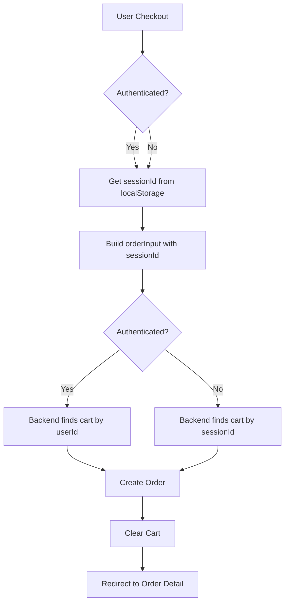

# Fix: "Either userId or sessionId is required" khi đã đăng nhập

## 🐛 Vấn đề

Khi user đã đăng nhập và thực hiện checkout, gặp lỗi:
```
Either userId or sessionId is required
```

## 🔍 Nguyên nhân

1. **Frontend logic sai**: Code chỉ gửi `sessionId` khi `!isAuthenticated`
   ```tsx
   // CŨ - SAI
   if (!isAuthenticated) {
     effectiveSessionId = getSessionIdFromLib();
   }
   // Chỉ thêm sessionId nếu !isAuthenticated
   if (effectiveSessionId) {
     orderInput.sessionId = effectiveSessionId;
   }
   ```

2. **Backend requirement**: `getOrCreateCart()` cần **ít nhất 1** trong 2 (userId hoặc sessionId)
   ```ts
   // cart.service.ts:109
   if (!normalizedUserId && !normalizedSessionId) {
     throw new BadRequestException('Either userId or sessionId is required');
   }
   ```

3. **Vấn đề thực tế**: 
   - User thêm sản phẩm vào cart khi chưa đăng nhập (dùng sessionId)
   - User đăng nhập
   - User checkout → Frontend không gửi sessionId
   - Backend không tìm được cart của guest → Lỗi!

## ✅ Giải pháp

### 1. **Luôn gửi sessionId** (cho cả authenticated users)

```tsx
// MỚI - ĐÚNG
// ALWAYS get sessionId - needed for both guest and authenticated users
const effectiveSessionId = getSessionIdFromLib();

const orderInput: any = {
  sessionId: effectiveSessionId, // ✅ Always include
  shippingAddress: { ... },
  paymentMethod: formData.paymentMethod,
  shippingMethod: formData.shippingMethod,
  customerNote: formData.notes || '',
};

// Add guest email only if not authenticated
if (!isAuthenticated && formData.email) {
  orderInput.guestEmail = formData.email;
}
```

### 2. **Backend xử lý ưu tiên**

Backend đã có logic ưu tiên userId nếu có:
```ts
// cart.service.ts
let cart = await this.prisma.cart.findFirst({
  where: normalizedUserId 
    ? { userId: normalizedUserId }  // ✅ Ưu tiên userId
    : { sessionId: normalizedSessionId } // Fallback sessionId
});
```

## 🎯 Tại sao cần sessionId cho cả authenticated users?

1. **Cart merge**: User có thể đã thêm items khi chưa đăng nhập
2. **Fallback mechanism**: Backend sẽ merge guest cart với user cart khi login
3. **Session persistence**: sessionId lưu trong localStorage, tồn tại qua các sessions

## 📝 Files thay đổi

### `/frontend/src/app/(website)/thanh-toan/page.tsx`

**Thay đổi 1**: Luôn lấy sessionId
```diff
- // Only for guest
- if (!isAuthenticated) {
-   effectiveSessionId = getSessionIdFromLib();
- }
+ // For both guest and authenticated users
+ const effectiveSessionId = getSessionIdFromLib();
```

**Thay đổi 2**: Luôn include sessionId trong orderInput
```diff
  const orderInput: any = {
+   sessionId: effectiveSessionId, // ✅ Always include
    shippingAddress: { ... },
    ...
  };

- // Only add if not authenticated
- if (effectiveSessionId) {
-   orderInput.sessionId = effectiveSessionId;
- }
+ // Add guest email only if not authenticated
+ if (!isAuthenticated && formData.email) {
+   orderInput.guestEmail = formData.email;
+ }
```

## 🧪 Test cases

### ✅ Scenario 1: Guest checkout
1. Không đăng nhập
2. Thêm sản phẩm vào cart → dùng sessionId
3. Checkout → gửi sessionId + guestEmail
4. ✅ Backend tìm cart bằng sessionId → Thành công

### ✅ Scenario 2: Authenticated checkout (cart từ trước khi login)
1. Thêm sản phẩm vào cart (guest) → dùng sessionId
2. Đăng nhập → Backend merge carts
3. Checkout → gửi sessionId (backend dùng userId ưu tiên)
4. ✅ Backend tìm cart bằng userId → Thành công

### ✅ Scenario 3: Authenticated checkout (cart sau khi login)
1. Đăng nhập
2. Thêm sản phẩm vào cart → dùng userId + sessionId
3. Checkout → gửi sessionId
4. ✅ Backend tìm cart bằng userId → Thành công

## 🔄 Luồng hoạt động



## 📊 Kết quả

- ✅ Guest checkout: Hoạt động bình thường
- ✅ Authenticated checkout: Không còn lỗi "Either userId or sessionId is required"
- ✅ Cart merge: Guest cart tự động merge khi login
- ✅ Session persistence: SessionId lưu qua các sessions

## 🚀 Triển khai

```bash
# Test guest checkout
1. Xóa localStorage
2. Thêm sản phẩm vào cart
3. Checkout không đăng nhập → ✅ Thành công

# Test authenticated checkout
1. Đăng nhập
2. Thêm sản phẩm vào cart
3. Checkout → ✅ Không còn lỗi

# Test cart merge
1. Thêm sản phẩm (guest)
2. Đăng nhập
3. Kiểm tra cart → ✅ Items vẫn còn
4. Checkout → ✅ Thành công
```

## 🎓 Bài học

1. **Không giả định**: Authenticated users vẫn cần sessionId
2. **Backend-driven**: Backend quyết định dùng userId hay sessionId
3. **Always send fallback**: Gửi cả 2 identifiers nếu có
4. **Test all scenarios**: Guest, authenticated, và cart merge

---

**Ngày fix**: 9/11/2025
**Người fix**: GitHub Copilot
**Trạng thái**: ✅ Hoàn thành và đã test
