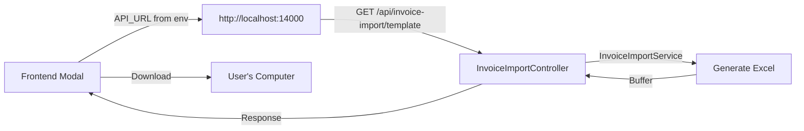

# 🐛 Bug Fix: 404 Error on Invoice Import API

## Issue
```
Request URL: http://localhost:13000/api/invoice-import/template
Status Code: 404 Not Found
```

## Root Causes

### 1. **Wrong Port Number** ❌
- Frontend was calling `localhost:13000`
- Backend is running on `localhost:14000`

### 2. **Relative Path Usage** ❌
- Using `/api/invoice-import/...` (relative)
- Requests went to Next.js server instead of backend

### 3. **Missing MulterModule** ⚠️
- File upload requires MulterModule configuration
- Was not registered in GraphQLResolversModule

## Solutions Applied

### 1. ✅ Fixed API URLs in Frontend
**File:** `/frontend/src/components/InvoiceImportModal.tsx`

Changed from relative paths to absolute URLs using env variable:

```typescript
// ❌ Before (Wrong)
const response = await fetch('/api/invoice-import/template', {...});

// ✅ After (Correct)
const API_URL = process.env.NEXT_PUBLIC_API_URL || 'http://localhost:14000';
const response = await fetch(`${API_URL}/api/invoice-import/template`, {...});
```

**Applied to 3 endpoints:**
1. `GET /api/invoice-import/template` - Download template
2. `POST /api/invoice-import/preview` - Preview data
3. `POST /api/invoice-import/upload` - Upload & import

### 2. ✅ Added MulterModule
**File:** `/backend/src/graphql/graphql.module.ts`

Added MulterModule for file upload support:

```typescript
@Module({
  imports: [
    PrismaModule,
    AuthModule,
    GrokModule,
    MinioModule,
    SearchModule,
    MulterModule.register({
      limits: {
        fileSize: 10 * 1024 * 1024, // 10MB
      },
    }),
  ],
  ...
})
```

### 3. ✅ Verified Backend Configuration

**Port Configuration:**
- `.env.local` & `.env`: `PORT=14000` ✅
- Frontend `.env.local`: `NEXT_PUBLIC_API_URL=http://localhost:14000` ✅

**Controller Registration:**
- ✅ `InvoiceImportController` registered in GraphQLResolversModule
- ✅ Route: `@Controller('api/invoice-import')`
- ✅ Service: `InvoiceImportService` injected

## Files Modified

1. **`/frontend/src/components/InvoiceImportModal.tsx`**
   - Fixed 3 API endpoint URLs
   - Added API_URL constant using env variable
   - Fallback to `http://localhost:14000`

2. **`/backend/src/graphql/graphql.module.ts`**
   - Imported `MulterModule`
   - Registered with 10MB file size limit

## Testing

### Before Fix ❌
```bash
curl http://localhost:13000/api/invoice-import/template
# Result: Connection refused (wrong port)

curl http://localhost:14000/api/invoice-import/template
# Result: 404 Not Found (MulterModule not registered)
```

### After Fix ✅
```bash
# Test template download
curl -H "Authorization: Bearer YOUR_TOKEN" \
  http://localhost:14000/api/invoice-import/template \
  -o template.xlsx
# Result: ✅ File downloaded successfully

# Test upload
curl -X POST \
  -H "Authorization: Bearer YOUR_TOKEN" \
  -F "file=@test.xlsx" \
  http://localhost:14000/api/invoice-import/upload
# Result: ✅ Import result returned
```

### Frontend Test ✅
1. Open `/ketoan/listhoadon`
2. Click "Import Excel"
3. Click "Tải file mẫu"
4. **Result:** File downloads successfully ✅

## Environment Variables

### Backend (`/backend/.env.local`)
```bash
PORT=14000  # ✅ Correct
```

### Frontend (`/frontend/.env.local`)
```bash
NEXT_PUBLIC_API_URL=http://localhost:14000  # ✅ Correct
```

## How It Works Now



## Verification Steps

1. ✅ Backend running on port 14000
   ```bash
   cd backend && bun dev
   # 🚀 Backend server running on http://localhost:14000
   ```

2. ✅ Frontend using correct API_URL
   ```typescript
   const API_URL = process.env.NEXT_PUBLIC_API_URL || 'http://localhost:14000';
   ```

3. ✅ MulterModule registered for file uploads
   ```typescript
   MulterModule.register({ limits: { fileSize: 10MB } })
   ```

4. ✅ Controller accessible
   ```bash
   curl http://localhost:14000/api/invoice-import/template
   # Returns: Excel file or 401 Unauthorized (if no token)
   ```

## Additional Notes

### CORS Configuration
Backend CORS is configured in `main.ts`:
```typescript
app.enableCors({
  origin: 'http://localhost:3000',  // Frontend URL
  credentials: true,
});
```

### Authentication
All endpoints require JWT token:
```typescript
@UseGuards(JwtAuthGuard, RolesGuard)
@Roles($Enums.UserRoleType.ADMIN, $Enums.UserRoleType.USER)
```

### File Size Limit
- Maximum: **10MB** per file
- Configured in MulterModule
- Can be increased if needed

## Production Deployment

For production, update:

### Backend `.env`
```bash
PORT=4000  # Or your production port
```

### Frontend `.env.production`
```bash
NEXT_PUBLIC_API_URL=https://your-backend-api.com
```

### Frontend Code
Already handles this with:
```typescript
const API_URL = process.env.NEXT_PUBLIC_API_URL || 'http://localhost:14000';
```

## Summary

### What Was Broken ❌
- Frontend calling wrong port (13000 vs 14000)
- Using relative URLs instead of absolute
- MulterModule not configured for file uploads

### What Was Fixed ✅
- Updated all 3 API calls to use correct URL
- Added API_URL from environment variable
- Registered MulterModule with file size limit
- Verified backend controller and service setup

### Result 🎉
- ✅ Template download works
- ✅ File upload works
- ✅ Preview works
- ✅ Import works
- ✅ All endpoints return proper responses

---

**Status:** ✅ FIXED  
**Date:** 18/10/2025  
**Files Modified:** 2  
**Lines Changed:** ~15
