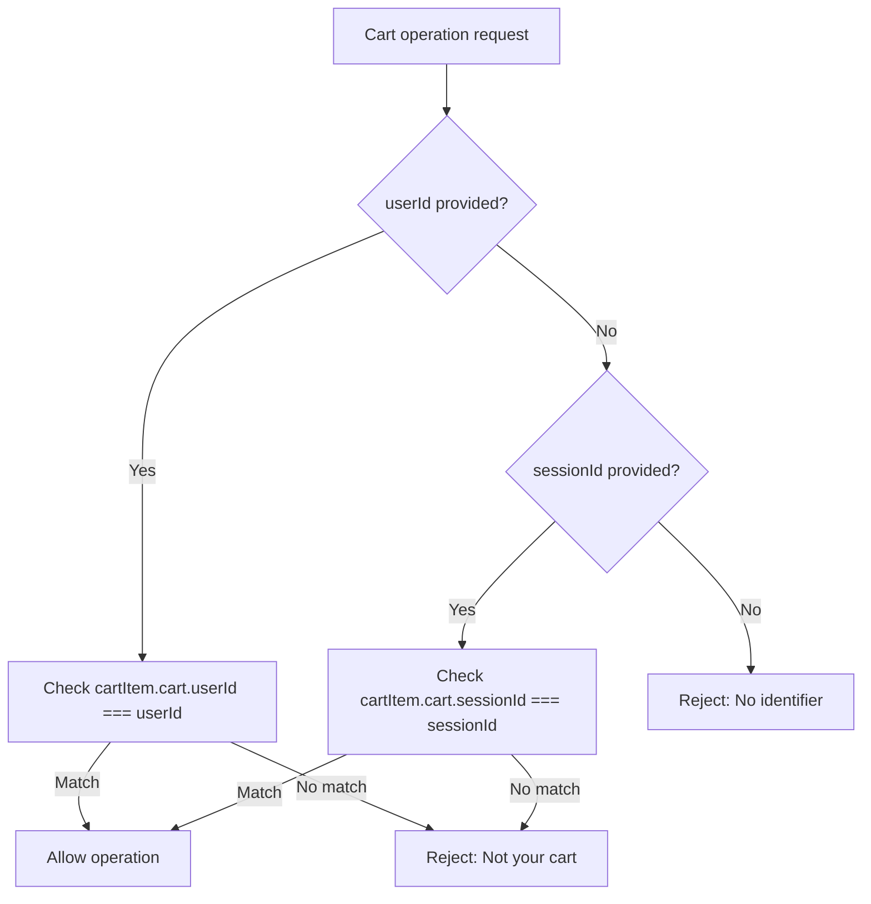

# Fix: Cart operations (update/remove) không hoạt động khi đã đăng nhập

## 🐛 Vấn đề

Khi đã đăng nhập và thực hiện các thao tác trên giỏ hàng:
- ❌ Xóa item: Không xóa được
- ❌ Cập nhật số lượng: Không update được
- ❌ Xóa toàn bộ giỏ: Không clear được

## 🔍 Nguyên nhân

### 1. Frontend: Chỉ gửi sessionId khi là guest
```tsx
// ❌ SAI - Chỉ gửi khi !isAuthenticated
await removeFromCart({
  variables: { 
    input: { itemId },
    sessionId: !isAuthenticated ? sessionId : undefined, // undefined khi đăng nhập!
  },
});
```

### 2. Backend: Logic verify ownership có lỗi
```ts
// ❌ SAI - Check cả 2 conditions riêng biệt
if (userId && cartItem.cart.userId !== userId) {
  throw new BadRequestException('Cart item does not belong to user');
}
if (sessionId && cartItem.cart.sessionId !== sessionId) {
  throw new BadRequestException('Cart item does not belong to session');
}
```

**Vấn đề**: 
- Cart của authenticated user có `userId`, không có `sessionId` (hoặc null)
- Frontend gửi cả `userId` (từ auth context) và `sessionId` (từ localStorage - có thể từ guest session cũ)
- Check thứ 2 `cartItem.cart.sessionId !== sessionId` sẽ **luôn fail** vì:
  - `cartItem.cart.sessionId` = null (authenticated cart)
  - `sessionId` = "session_xxx" (từ localStorage)
  - null !== "session_xxx" → true → throw error!

## ✅ Giải pháp

### 1. Frontend: Luôn gửi fresh sessionId

**File: `/frontend/src/app/(website)/gio-hang/page.tsx`**

```tsx
// ✅ Lấy fresh sessionId trước mỗi mutation
const handleUpdateQuantity = async (itemId: string, newQuantity: number) => {
  const effectiveSessionId = getSessionIdFromLib();
  
  await updateCartItem({
    variables: { 
      input: { itemId, quantity: newQuantity },
      sessionId: effectiveSessionId, // ✅ Luôn gửi
    },
  });
};

const handleRemoveItem = async (itemId: string) => {
  const effectiveSessionId = getSessionIdFromLib();
  
  await removeFromCart({
    variables: { 
      input: { itemId },
      sessionId: effectiveSessionId, // ✅ Luôn gửi
    },
  });
};

const handleClearCart = async () => {
  const effectiveSessionId = getSessionIdFromLib();
  
  await clearCart({
    variables: {
      sessionId: effectiveSessionId, // ✅ Luôn gửi
    },
  });
};
```

### 2. Backend: Ưu tiên userId, chỉ check sessionId nếu không có userId

**File: `/backend/src/services/cart.service.ts`**

#### Fix `updateItem()`:
```ts
// ✅ ĐÚNG - Ưu tiên userId
if (userId) {
  // Authenticated user - ONLY check userId
  if (cartItem.cart.userId !== userId) {
    throw new BadRequestException('Cart item does not belong to user');
  }
} else if (sessionId) {
  // Guest user - check sessionId
  if (cartItem.cart.sessionId !== sessionId) {
    throw new BadRequestException('Cart item does not belong to session');
  }
} else {
  throw new BadRequestException('Either userId or sessionId is required');
}
```

#### Fix `removeItem()`:
```ts
// ✅ ĐÚNG - Ưu tiên userId
if (userId) {
  // Authenticated user - ONLY check userId
  if (cartItem.cart.userId !== userId) {
    throw new BadRequestException('Cart item does not belong to user');
  }
} else if (sessionId) {
  // Guest user - check sessionId
  if (cartItem.cart.sessionId !== sessionId) {
    throw new BadRequestException('Cart item does not belong to session');
  }
} else {
  throw new BadRequestException('Either userId or sessionId is required');
}
```

## 🎯 Logic ưu tiên

### Tại sao cần ưu tiên userId?

**Scenario**: Authenticated user với cart history
1. User thêm items khi chưa đăng nhập → Cart có `sessionId = "session_123"`
2. User đăng nhập → Backend merge carts → Cart có `userId = "user_456"`, `sessionId = null`
3. User update item → Frontend gửi:
   - `userId = "user_456"` (từ auth context)
   - `sessionId = "session_123"` (vẫn còn trong localStorage)
4. Backend cần ưu tiên `userId`:
   - ✅ Check `cartItem.cart.userId === userId` → Match! → Allow
   - ❌ Không check sessionId vì đã có userId

### Flow chart:



## 📝 Files thay đổi

### Frontend:
1. `/frontend/src/app/(website)/gio-hang/page.tsx`
   - Import `getSessionIdFromLib`
   - Update `handleUpdateQuantity()` - luôn gửi fresh sessionId
   - Update `handleRemoveItem()` - luôn gửi fresh sessionId
   - Update `handleClearCart()` - luôn gửi fresh sessionId

### Backend:
1. `/backend/src/services/cart.service.ts`
   - Update `updateItem()` - ưu tiên userId
   - Update `removeItem()` - ưu tiên userId

## 🧪 Test cases

### ✅ Scenario 1: Guest user operations
1. Không đăng nhập
2. Thêm items vào cart
3. Update quantity → ✅ Thành công (check sessionId)
4. Remove item → ✅ Thành công (check sessionId)
5. Clear cart → ✅ Thành công (check sessionId)

### ✅ Scenario 2: Authenticated user operations
1. Đăng nhập
2. Thêm items vào cart
3. Update quantity → ✅ Thành công (check userId, ignore sessionId)
4. Remove item → ✅ Thành công (check userId, ignore sessionId)
5. Clear cart → ✅ Thành công (check userId, ignore sessionId)

### ✅ Scenario 3: After login (merged cart)
1. Thêm items as guest (sessionId = "session_123")
2. Đăng nhập → Cart merged (userId = "user_456", sessionId = null)
3. localStorage vẫn có "session_123"
4. Update item → ✅ Thành công:
   - Backend nhận: userId = "user_456", sessionId = "session_123"
   - Check userId first → Match → Allow
   - Không check sessionId (vì đã có userId)

## 🚨 Vấn đề trước đây

### Guest user: ✅ Hoạt động
```
Request: { sessionId: "session_123" }
Cart: { userId: null, sessionId: "session_123" }
Check 1: userId undefined → Skip
Check 2: sessionId matches → ✅ Allow
```

### Authenticated user: ❌ Bị lỗi
```
Request: { userId: "user_456", sessionId: "session_123" }
Cart: { userId: "user_456", sessionId: null }
Check 1: userId matches → ✅ Pass
Check 2: sessionId !== null → ❌ FAIL → Reject!
```

## ✅ Giải pháp hiện tại

### Guest user: ✅ Vẫn hoạt động
```
Request: { sessionId: "session_123" }
Cart: { userId: null, sessionId: "session_123" }
if (userId) → No
else if (sessionId) → Yes
  Check: sessionId matches → ✅ Allow
```

### Authenticated user: ✅ Đã fix
```
Request: { userId: "user_456", sessionId: "session_123" }
Cart: { userId: "user_456", sessionId: null }
if (userId) → Yes
  Check: userId matches → ✅ Allow
  → Không check sessionId nữa
```

## 🎓 Best Practices

### Frontend pattern:
```tsx
// ✅ ĐÚNG - Luôn lấy fresh sessionId
const handleAction = async () => {
  const sessionId = getSessionIdFromLib();
  await mutation({
    variables: { sessionId }
  });
};
```

### Backend pattern:
```ts
// ✅ ĐÚNG - Ưu tiên userId
if (userId) {
  // Check userId only
  if (cart.userId !== userId) throw error;
} else if (sessionId) {
  // Check sessionId only
  if (cart.sessionId !== sessionId) throw error;
} else {
  throw new BadRequestException('Either userId or sessionId is required');
}
```

## 🔄 Related fixes

- [FIX_AUTHENTICATED_CHECKOUT_SESSIONID.md](./FIX_AUTHENTICATED_CHECKOUT_SESSIONID.md) - Checkout sessionId fix
- [FIX_ADD_TO_CART_SESSIONID.md](./FIX_ADD_TO_CART_SESSIONID.md) - Add to cart sessionId fix

---

**Ngày fix**: 9/11/2025
**Người fix**: GitHub Copilot
**Trạng thái**: ✅ Hoàn thành
**Test**: Cần test toàn bộ cart operations (guest + authenticated)
